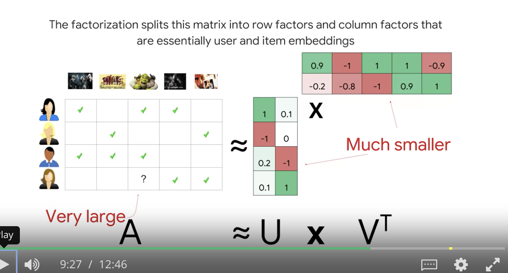

## The basic idea

- we receive all rpds created by editors
- get study entities (prerequisites & outcomes of them)
- count how many times editor used each entity
- form sparse matrix for all editors and entities
- if editor A much interacted with entities X1, X2, X3 he might be similar to editor B who ... — collaborative filtering

* dot product between everything — **Content Based**

* ALS, MF — **Collaborative**